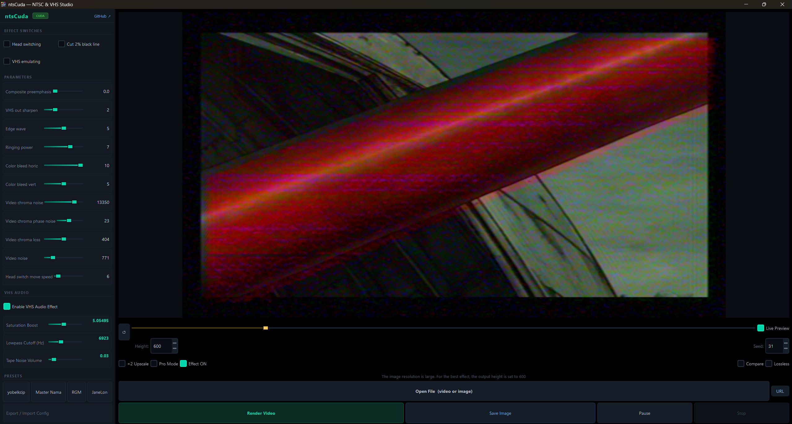

<div align="center">

# ntsCuda

[](https://python.org)
[](requirements-cuda.txt)

<br>

### Physically accurate NTSC & VHS analog video artifact emulator

*GPU acceleration · Vertical compare slider · VHS audio simulation · Drag & drop · 30+ formats · Modern dark UI*

<br>



<br><br>

Based on [zhuker/ntsc](https://github.com/zhuker/ntsc) · Old GUI by [JargeZ/ntscQT](https://github.com/JargeZ/ntscQT) · [MIT License](LICENSE)

</div>

---

<div align="center">

## ✨ Features

</div>

<table>
<tr>
<td width="33%" valign="top">

### ⚡ GPU / CUDA Acceleration
Zero-config. Install CuPy — done. ntsCuda auto-detects your GPU and activates hardware acceleration. Falls back to CPU silently if no GPU is found. A live **CUDA badge** appears in the UI when GPU is active.

- **FFT ringing** → 5–20× faster
- **Color space** → 2–5× faster

</td>
<td width="33%" valign="top">

### 🚀 Vectorized Processing
All per-scanline Python loops replaced with batched NumPy operations across the entire signal pipeline.

- Composite lowpass / VHS luma → **40–60×**
- Phase noise, chroma decode → **15–50×**

</td>
<td width="33%" valign="top">

### 🎨 30+ Formats
Open **19 video** and **11 image** formats. Save processed images in **5 output formats** with quality control. All / Video / Image filter categories in the picker.

</td>
</tr>
<tr>
<td valign="top">

### 🔊 VHS Audio Simulation
Optional audio effect that simulates the lo-fi, degraded sound of VHS tapes — saturation boost, lowpass filter, and tape noise. Toggle and fine-tune directly from the UI.

</td>
<td valign="top">

### 🖱️ Drag & Drop
Drop any supported video or image directly onto the window — no dialog needed. Full drag & drop support for instant loading.

</td>
<td valign="top">

### 🌗 Dark Modern UI
Clean, dark-themed interface with consistent styling, CUDA status indicator, and optimized slider layout. Appearance theme follows your OS automatically.

</td>
</tr>
</table>

---

## 🖥️ UI Preview

<div align="center">


*Modern dark UI with CUDA badge, VHS audio controls, and parameter sliders*

</div>

---

## 🔀 Compare Mode

<div align="center">


*Vertical split-screen with draggable slider — see original vs. processed side by side*

</div>

---

## 🎬 How to Use

<div align="center">


*Load a file, adjust parameters, and render — it's that simple*

</div>

---


## Supported Formats

<div align="center">

| | Input | Output |
|---|---|---|
| **Video** | `mp4` `mkv` `avi` `webm` `gif` `mov` `flv` `wmv` `mpg` `mpeg` `ts` `m4v` `3gp` `ogv` `mxf` `vob` `m2ts` `mts` `f4v` `rm` `rmvb` | `mp4` · `mkv` *(lossless FFV1)* |
| **Image** | `png` `jpg` `jpeg` `webp` `bmp` `tiff` `tif` `tga` `ppm` `pgm` `pbm` | `png` · `jpg` *(95%)* · `bmp` · `tiff` · `webp` *(90%)* |

</div>

---

## Simulated Artifacts

<div align="center">

| Artifact | Description |
|---|---|
| **Dot Crawl** | Animated crawling dots along high-saturation horizontal edges from luma/chroma multiplex |
| **Ringing** | Echo fringes around sharp edges — oscillation artifact common in early VTR hardware |
| **Color Bleeding** | Y/C timing mismatch shifts chroma relative to luma, creating blurry color halos |
| **Rainbow Effects** | Cross-color from imperfect luma/chroma separation on fine patterns and subtitles |
| **Chrominance Noise** | Colored specks in dark, saturated areas from low-light or multi-gen dubs |
| **Head Switching Noise** | Horizontal noise band at frame bottom from VHS head switching transients |
| **LP/EP Degradation** | Reduced tape speed artifacts — banding, smearing, increased noise sensitivity |
| **Luminance Noise** | White noise in brightness channel from worn tape, long cables, or dirty heads |
| **Oversaturation** | Chroma amplitude beyond 120 IRE causes color to bleed past object boundaries |
| **VHS Audio** | Lo-fi sound simulation — saturation, lowpass filter, tape noise |

</div>

---

## Installation

<details>
<summary><b>Windows</b></summary>

```powershell
# Install FFmpeg (if not already installed)
choco install ffmpeg

# Clone and set up
git clone https://github.com/AllastorV/ntsCuda
cd ntsCuda
python -m venv venv
.\venv\Scripts\activate
pip install -r requirements.txt

# Run
python ntsCuda.py
```

**Next time:**
```powershell
cd ntsCuda && .\venv\Scripts\activate && python ntsCuda.py
```

Or use the provided batch files:
```powershell
install.bat    # First-time setup
start.bat      # Launch the app
```

</details>

<details>
<summary><b>macOS & Linux</b></summary>

```bash
# macOS
brew install ffmpeg

# Ubuntu / Debian
sudo apt install ffmpeg libxcb-xinerama0

# Clone and set up
git clone https://github.com/AllastorV/ntsCuda ~/ntsCuda
cd ~/ntsCuda
python3 -m venv venv
source venv/bin/activate
pip install -r requirements.txt

# Run
python ntsCuda.py
```

**Next time:**
```bash
cd ~/ntsCuda && source venv/bin/activate && python ntsCuda.py
```

</details>

<details>
<summary><b>Apple Silicon (M1 / M2)</b></summary>

```bash
brew install pyqt@5
git clone https://github.com/AllastorV/ntsCuda ~/ntsCuda
cd ~/ntsCuda
python3 -m venv venv
cp -R /opt/homebrew/Cellar/pyqt@5/5.15.6/lib/python3.9/site-packages/* \
      ./venv/lib/python3.9/site-packages/
source venv/bin/activate
pip install --pre -i https://pypi.anaconda.org/scipy-wheels-nightly/simple scipy
pip install --ignore-installed -r requirements.m1-temp.txt
venv/bin/python ntsCuda.py
```

</details>

<details>
<summary><b>GPU / CUDA Acceleration (optional)</b></summary>

Install CuPy matching your CUDA version. ntsCuda auto-detects it — no other setup required.

```bash
nvcc --version          # check your CUDA version

pip install cupy-cuda12x   # CUDA 12.x
pip install cupy-cuda11x   # CUDA 11.x
pip install cupy-cuda102   # CUDA 10.2
```

> If no GPU is detected, ntsCuda runs in CPU-only mode automatically.
> A green **CUDA** badge appears in the UI when GPU acceleration is active.
> See [`requirements-cuda.txt`](requirements-cuda.txt) for details.

</details>

---

## Usage

| Control | Description |
|---|---|
| **Open File** | Browse for a video or image — or just drag & drop it onto the window |
| **URL** | Load an image directly from a web URL |
| **Seed** | Deterministic randomness — same number always produces the same artifacts |
| **Height** | Processing resolution. Lower = faster preview |
| **Effect ON** | Toggle the NTSC effect on/off without stopping the render |
| **Compare** | Vertical split-screen with draggable slider — original left vs. processed right |
| **x2 Upscale** | Output at double resolution (nearest-neighbor) |
| **Lossless** | Encode with FFV1 lossless codec (outputs `.mkv`) |
| **Pro Mode** | Reveals advanced low-level signal parameters |
| **Live Preview** | Show every rendered frame (default: every 10th) |
| **VHS Audio** | Enable lo-fi VHS audio simulation with adjustable parameters |
| **Refresh** | Re-render current frame with current slider values |
| **Pause** | Pause mid-render, tweak sliders, resume — creates time-varying effects |
| **Stop** | Abort the current render |
| **Export / Import Config** | Share your exact slider configuration as JSON |

### Tips

> **Cut before you process.** Run only the clip you need — not the whole file.

> **Sliders work live.** Drag them during render (no pause) to create smoothly evolving effects.

> **Seed is king.** Same seed = identical artifact pattern every time. Great for reproducible results.

> **Preview fast, render full.** Use a low Height for preview, raise it to source resolution for final output.

> **Drag & drop.** Drop any supported file directly onto the window for instant loading.

---

## Performance

All per-scanline Python loops replaced with batched NumPy operations. GPU via CuPy is optional and zero-config.

| Function | Optimization | CPU Speedup | GPU Speedup |
|---|---|---|---|
| `composite_lowpass` | `lfilter(axis=1)` batch | ~40–60× | — |
| `composite_lowpass_tv` | `lfilter(axis=1)` batch | ~40–60× | — |
| `composite_preemphasis` | single-stage `lfilter` | ~40× | — |
| `vhs_luma_lowpass` | 3-stage + highpass batch | ~50× | — |
| `vhs_chroma_lowpass` | U+V channels batched | ~60× | — |
| `vhs_sharpen` | in-place broadcast | ~30× | — |
| `video_chroma_phase_noise` | sin/cos vectorized | ~15× | — |
| `chroma_from_luma` | `cumsum` + batch decode | ~50× | — |
| `ringing` / `ringing2` | FFT (NumPy → CuPy) | 2–5× | **5–20×** |
| `bgr2yiq` / `yiq2bgr` | NumPy broadcast | 2–3× | **2–5×** |

---

## Bug Fixes

| # | Fix |
|---|---|
| 1 | `np.float` deprecation → `np.float32` / `np.float64` |
| 2 | Audio `getattr` fallbacks — no crash when audio stream is absent |
| 3 | `composite_layer` field parameter corrected (`field=0, fieldno=0`) |
| 4 | Null-guard on preview renderer — no crash before first file is opened |
| 5 | Video track slider signal leak fixed on file re-open |
| 6 | Template loading moved to background thread — UI no longer freezes |
| 7 | `status_string` `NameError` in `Renderer.run()` when paused before first frame |
| 8 | PNG export now saves the current processed frame instead of the cover image |
| 9 | `float division by zero` crash on startup fixed |
| 10 | 2x upscale rendering corrected |

---

## Alternatives

| Project | Notes |
|---|---|
| [**NTSC-RS**](https://github.com/valadaptive/ntsc-rs) | Rust — significantly faster · OpenFX & After Effects plugins |
| [**NtscQT+**](https://github.com/rgm89git/ntscQTPlus) | Fork with additional parameters |
| [**valadaptive/ntscQT**](https://github.com/valadaptive/ntscQT) | Fork with various bug fixes |
| **The Signal** *(paid)* | AE plugin, same algorithm — free alternative: ntsc-rs |

---

## Community

<div align="center">

**[RGM's ntscQT Presets](https://github.com/rgm89git/rgms-ntscQT-presets)** — community preset collection

<br>

[](https://youtu.be/O9jpc5rySUI)

*Complete guide by Jonah Longoria*

<br>

[](https://youtu.be/hV9IoedRe7I)
[](https://youtu.be/S6Qn-_wWuMc)
[](https://youtu.be/M7vZqABy85M)
[](https://youtu.be/uqT3Z0kfF24)

</div>
